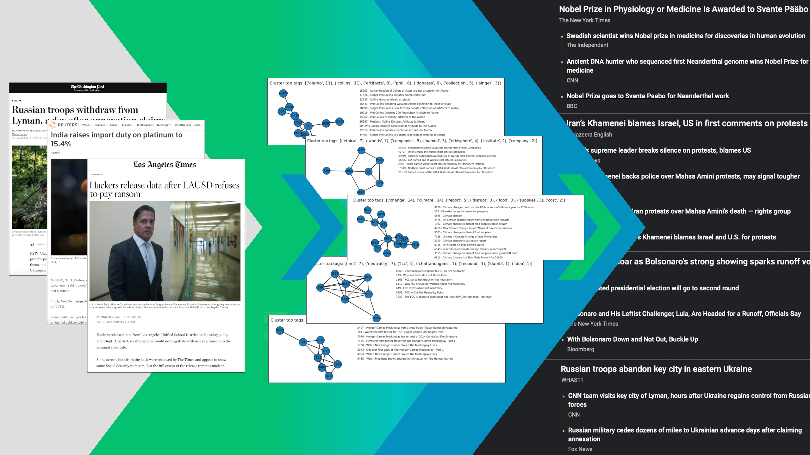

# clustering-news

## Overview

This project uses Locality-Sensitive Hashing (MinHash) and graph processing to cluster news articles based on their estimated Jaccard Similarity.

In a Jupyter notebook, we cluster news articles obtained from the UCI Machine Learning Repository by creating a Bag of Words to represent our article content and then performing Locality-Sensitive Hashing with MinHash on our Bag of Words. Then we create a graph where each node is an article and each edge is a match based on two articles exceeding the threshold of their estimated Jaccard Similarity (from our LSH). Finally, we calculate clusters of articles using the connected components of our graph.
 

## Data

Data obtained from UCI Machine Learning Repository - https://archive.ics.uci.edu/ml/datasets/News+Aggregator

## Parameters

By default, this notebook:
 - Processes a sample of 50,000 articles (~10%) from the total dataset of ~423,000
 - Uses 128 minhashes to calculate Jaccard similiarity
 - Outputs the first 10 clusters found in our graph, with at least 5 articles (ignoring small clusters) and less than 30 (improves readability) articles
  
### Training Parameters
You can alter the sample size to include less, more, or all of the data. Including the entire dataset requires a significant amount of memory (> 16 GB), as we are trading space complexity for time complexity in our algorithm. Increasing the number of hashes will have little effect on our results. Reducing the hash number will widen the margin of error for our estimated similarity. 
 
### Output Parameters
You can alter the number of clusters and which clusters to include in the output. With 50,000 articles, we generally find thousands of clusters, so limiting the output is advisable. Setting the min and max articles helps to ensure that the outputted clusters are significant and readable, respectively.
